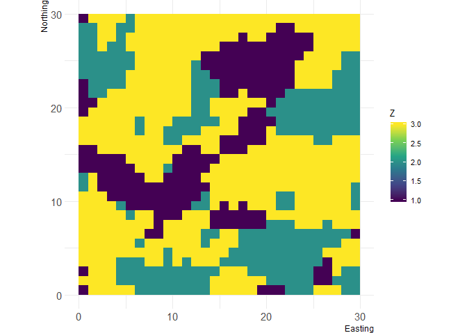
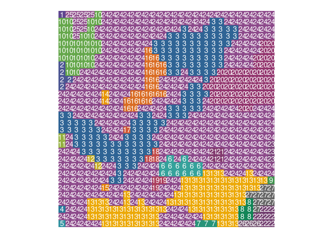

[](https://travis-ci.org/marcosci/landscapemetrics)
[](https://ci.appveyor.com/project/marcosci/landscapemetrics)
[](https://codecov.io/github/marcosci/landscapemetrics?branch=master)
[](https://www.tidyverse.org/lifecycle/#experimental)

<!-- README.md is generated from README.Rmd. Please edit that file -->

# landscapemetrics

**landscapemetrics** is an R package for calculating landscape metrics
for categorical landscape patterns in a tidy workflow. It offers most of
the metrics that are available in the standalone software FRAGSTATS
(McGarigal, SA Cushman & Ene, 2012) but also allows for implementation
of future (meaningful) categorical landscape metrics.

This package supports `raster` spatial objects and takes `RasterLayer`,
`RasterStacks`, `RasterBricks` or lists of `RasterLayer` as input
arguments.

Every function can be used in a piped workflow, as it always takes the
data as the first argument and returns a tibble of the same dimension.

## Installation

You can install **landscapemetrics** from GitHub with:

``` r
# install.packages("devtools")
devtools::install_github("marcosci/landscapemetrics")
```

## Using landscapemetrics

The functions in **landscapemetrics** starts with `lsm_` and next are
named based on a combination of abbreviations describing the scale
(patch - `p`, class - `c` or landscape - `l`) and metric they calculate:

    # landscapemetrics
    lsm_"level"_"metric" example:
    
    # Patch level
    ## lsm_p_"metric" example:
    lsm_p_enn()
    
    # Class level
    ## lsm_c_"metric" example:
    lsm_c_enn()
    
    # Landscape level
    ## lsm_p_"metric" example:
    lsm_l_enn()

…and returns a tibble with the same columns:

| layer | level     | class | id | metric           | value |
| ----- | --------- | ----- | -- | ---------------- | ----- |
| 1     | patch     | 1     | 1  | landscape metric | x     |
| 1     | class     | 1     | NA | landscape metric | x     |
| 1     | landscape | NA    | NA | landscape metric | x     |

### Using metric functions

Every function follows the same implementation design, so the usage is
quite straight forward:

``` r
library(landscapemetrics)
library(tidyverse)
#> ── Attaching packages ─────────────────────────────────────────────── tidyverse 1.2.1 ──
#> ✔ ggplot2 2.2.1.9000     ✔ purrr   0.2.5     
#> ✔ tibble  1.4.2          ✔ dplyr   0.7.5     
#> ✔ tidyr   0.8.1          ✔ stringr 1.3.1     
#> ✔ readr   1.1.1          ✔ forcats 0.3.0
#> ── Conflicts ────────────────────────────────────────────────── tidyverse_conflicts() ──
#> ✖ dplyr::filter() masks stats::filter()
#> ✖ dplyr::lag()    masks stats::lag()

# Landscape raster
landscape
#> class       : RasterLayer 
#> dimensions  : 30, 30, 900  (nrow, ncol, ncell)
#> resolution  : 1, 1  (x, y)
#> extent      : 0, 30, 0, 30  (xmin, xmax, ymin, ymax)
#> coord. ref. : NA 
#> data source : in memory
#> names       : clumps 
#> values      : 1, 3  (min, max)

## plot landscape
landscapetools::util_plot(landscape)
```



``` r

# Calculate Euclidean Nearest-Neighbor Distance on patch level
landscape %>% 
  lsm_p_enn()
#> # A tibble: 27 x 6
#>    layer level class    id metric                                    value
#>    <int> <chr> <int> <int> <chr>                                     <dbl>
#>  1     1 patch     1     1 euclidean nearest neighbor distance dist…  7   
#>  2     1 patch     1     2 euclidean nearest neighbor distance dist…  4   
#>  3     1 patch     1     3 euclidean nearest neighbor distance dist…  2.83
#>  4     1 patch     1     4 euclidean nearest neighbor distance dist…  2   
#>  5     1 patch     1     5 euclidean nearest neighbor distance dist…  2   
#>  6     1 patch     1     6 euclidean nearest neighbor distance dist…  2.83
#>  7     1 patch     1     7 euclidean nearest neighbor distance dist…  4.12
#>  8     1 patch     1     8 euclidean nearest neighbor distance dist…  4.12
#>  9     1 patch     1     9 euclidean nearest neighbor distance dist…  4.24
#> 10     1 patch     2    10 euclidean nearest neighbor distance dist…  4.47
#> # ... with 17 more rows
```

### Connected labelling

`landscapemetrics` makes internally heavy use an implementatian of a
connected labelling algorithm by Thell Fowler
(<https://github.com/Thell/ccloutline>) and exports an reimplementation
of this algorithm:

``` r
cclabel_landscape <- landscapemetrics::cclabel(landscape)
landscapetools::util_facetplot(cclabel_landscape, nrow = 1)
```


### Visualizing patches

`landscapemetrics` also offers a plotting function to visualize patches
in a landscape and encode each patch with an ID that can be used to
compare a landscape metric with the actual landscape:

``` r
show_patches(landscape)
```



## Contributing

Bug reports, suggestions for new metrics, and especially code
contributions are welcome. Please see
[CONTRIBUTING.md](https://github.com/marcosci/landscapemetrics/blob/master/CONTRIBUTING.md).
Maintainers and contributors must follow this repository’s [code of
conduct](CODE_OF_CONDUCT.md).
