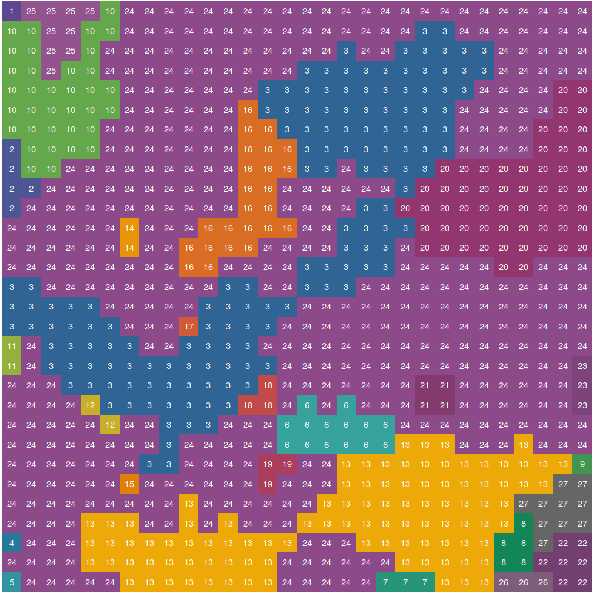

```{r setup, include = FALSE}
knitr::opts_chunk$set(
  collapse = TRUE,
  comment = "#>"
)
```

```{r load_libraries_hidden, eval=TRUE, echo=FALSE, message=FALSE, results='hide'}
library(landscapemetrics)
```

# Introduction

Ecology and landscape ecology mainly studies interactions between organisms and their environment.
In a wider sense, the environment perceived by the organism can be defined as a landscape.
This can spread from huge areas for e.g. mobile, large-bodied mammals to much smaller areas for e.g. immobile insects and always depends on the research question.

Landscape metrics are tools to characterize a landscape.
This includes mainly describing the composition and configuration of a landscape.
While the composition basically describes how much of the landscape is occupied by a certain land cover type, the configuration mainly describes the spatial arrangement of the landcover types.
The basic idea of landscape metrics is to condense as much information as possible into single number.

The **landscapemetrics** package supports `raster` spatial objects. 
A raster (sometimes also referred to as grid) contains spatial information by dividing the landscape into discrete cells.
Consequently, the cells are the smallest "resolution of information".
Because **landscapemetrics** deals with categorical data, each cell has to be assigned to a discrete class. 
These classes must be positive integer numbers. 

## Levels of landscape metrics

**Landscape metrics** can be calculated for three different levels (or "scales").
Each level contains information about different aspects of the landscape.
Level of interest depends largely on the research question.
Often, even a combination of several levels can be useful.
Similar, also the decision of which metric to use depends on the research question asked.   

**A patch** is defined as neighboring cells belonging to the same class `i`.
Hereby, **landscapemetrics** uses the 8-neighbors rule (Queen's case) to identify patches.
Patch level metrics are calculated for every patch in the landscape, regardless of the class that the patch belongs to.
The output will match the number of patches present in the landscape.
These metrics are also often the basis for metrics of the other two levels.

**Class level metrics** summarise all patches belonging to one class `i`. 
These metrics can be either the "distribution" of patch level metrics of all patches of class `i` (e.g. the mean) or consider only patches of class `i` for the calculations of the metric.
Regardless of the mathematical background, the output will always match the number of classes present. 
Class level metrics are suitable to describe the composition and configuration of the landscape.

**Landscape level metrics** summarise the whole landscape into one value.
This can either be done by summarising metrics of lower levels or calculating a metric including all patches and classes.
Following, the output will always be just one number. 
Landscape level metrics are suitable for condensing information about the landscape into just one value.

## Classes of landscape metrics

There are five different classes of landscape metrics implemented in **landscapemetrics**:

1. **Area and edge metrics** describe the size of patches and classes and the amount of edge.
An edge is defined as the border between two patches of class `i` and `k` in meters. 
These metrics mainly characterize the composition of the landscape and are able to show dominance or rareness of classes.
2. **Shape metrics** describe the shape of patches, mainly by using its area and perimeter.
This can be important for many research questions, because e.g. even though, being equal in size, long and narrow patches has probably different characteristics than a squared patch of the same size.
3. **Core metrics** describe the area of patches that are not an edge. 
These metrics can be interesting for research questions in which e.g. only areas that are not influenced by neighboring patches of a different class are of interest.
4. **Aggregation metrics** describe if patches (of the same class) are rather clumped (aggregated) or tend to be isolated.
Following, these metrics describe mainly the spatial configuration of the landscape.
5. **Diversity metrics** are only available on the landscape level.
They describe the abundance and dominance/rareness of classes.
Thereby, they show the diversity of present classes.

### References 

McGarigal, K., SA Cushman, and E Ene. 2012. FRAGSTATS v4: Spatial Pattern Analysis Program for Categorical and Continuous Maps. Computer software program produced by the authors at the University of Massachusetts, Amherst. Available at the following website: http://www.umass.edu/landeco/research/fragstats/fragstats.html

## Other Software

All metrics are based on the stand-alone software FRAGSTATS (for more information see [here](https://www.umass.edu/landeco/research/fragstats/documents/fragstats_documents.html)).
However, FRAGSTATS is only available on Windows.
Moreover, even though the software is quite extensive and computational fast, we wanted to implement most of the metrics in R because it is probably the most used data analyzing tool in ecology. 
Another package containing at least a few landscape metrics is `SDMTools`, however, there are no landscape level metrics and also not all of the possible metrics on patch and class level can be found.
Those were the main reasons we implemented **landscapemetrics**, however, we want to fully appreciate and acknowledgment the already present software.

# Using **landscapemetrics**

The functions in **landscapemetrics** starts with `lsm_` and next are named based on a combination of abbreviations describing the scale (patch - `p`, class - `c` or landscape - `l`) and metric they calculate:

```
# landscapemetrics
lsm_"level"_"metric" example:

# Patch level
## lsm_p_"metric" example:
lsm_p_enn()

# Class level
## lsm_c_"metric" example:
lsm_c_enn()

# Landscape level
## lsm_p_"metric" example:
lsm_l_enn()
```

...and they return a tibble with the same columns:

<p style="text-align:center;">

| layer  | level | class | id | metric | value
| ------------- | -------------  | ------------- | ------------- | ------------- | ------------- | 
| 1 | patch  | 1 | 1 | landscape metric | x |
| 1 | class  | 1 | NA | landscape metric | x |
| 1 | landscape  | NA | NA | landscape metric | x |

</p>

A possible use case is that you would load your spatial data, calculate some landscape metrics and then use the resulting tibble in further analyses.

```{r, message=FALSE}
# load packages
library(landscapemetrics)
library(raster)
library(dplyr)

# Import raster
landscape_raster <- landscapemetrics::landscape
# for local file: raster("pathtoyourraster/raster.asc")
# ... or any other raster file type, geotiff, ...

# Calculate all available landscape metrics 
landscape_raster %>% 
  lsm_p_perim()
```

## Important information about using **landscapemetrics**

- The resolution of a raster cell has to be in **meters**, as the package converts units internally and returns results in a square "area" for some metrics.

## Using **landscapemetrics** in a tidy workflow

### Pipe landscapes into the functions

Every function in *landscapemetrics* accept data as its first argument, which makes piping a natural workflow:

```{r} 
landscape %>% 
  lsm_p_enn()
``` 

### Use multiple metric functions

As the result of every function always returns a tibble, combining the metrics that were selected for your research question is straightforward:

```{r}
# bind results from different metric functions
patch_metrics <- dplyr::bind_rows(
  lsm_p_cai(landscape),
  lsm_p_circle(landscape),
  lsm_p_enn(landscape)
  )
# look at the results
patch_metrics 
```

## Connected labelling 

`landscapemetrics` makes internally heavy use of an implementatian of the connected labelling algorithm by Thell Fowler (https://github.com/Thell/ccloutline) and exports an reimplementation of this algorithm:

```{r eval=FALSE}
cclabel_landscape <- landscapemetrics::cclabel(landscape)
landscapetools::util_facetplot(cclabel_landscape, nrow = 1)
```

{width=100%}

## Visualizing patches

To visualize patches in a landscape and encode each patch with an ID that can be used to compare a landscape metric with the actual landscape you can use the R package [*landscapetools*](https://github.com/ropensci/landscapetools) (currently only in the version on Github):

```{r eval=FALSE}
landscapetools::util_show_patches(landscape)
```

{width=100%}

We think, this helps a lot to get a better understandment of the landscape metrics and composition and configuration of the landscape of interest.
